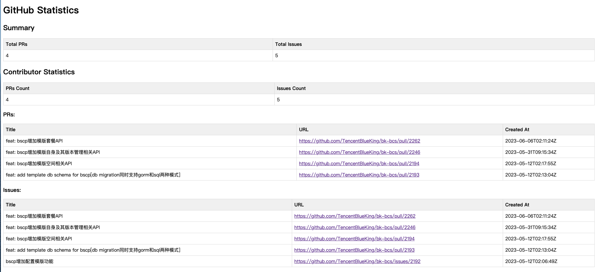

# GitHub 贡献者统计

该程序从 GitHub 仓库中获取贡献者统计信息，包括有关拉取请求（Pull Requests）、问题（Issues）和可选的提交（Commits）的信息。它会生成一个以表格形式呈现统计信息的 HTML 文件。

## 使用方法

### 先决条件

- Go 编程语言（版本 1.16+）
- GitHub 认证令牌（可选，仅适用于私有仓库或用于避免 API 速率限制）

### 安装

1. 克隆该仓库或下载源代码。
2. 打开终端并导航到项目目录。

### 运行程序

1. 打开终端并导航到项目目录。
2. 使用以下命令构建程序：

   ```bash
   go build
   ```

3. 使用所需的选项运行程序。以下是可用的命令行参数：

    - `-repoOwner`：仓库所有者（默认值：`TencentBlueKing`）
    - `-repoName`：仓库名称（默认值：`bk-bcs`）
    - `-contributorUsername`：贡献者用户名（默认值：`fireyun`）
    - `-startDate`：开始日期，格式为 `YYYY-MM-DD`（默认值：上个月的开始日期）
    - `-endDate`：结束日期，格式为 `YYYY-MM-DD`（默认值：当前日期）
    - `-filename`：生成的 HTML 文件的输出文件名（默认值：`statistics.html`）
    - `-includeCommits`：在统计信息中包括提交数据（默认值：`false`）
    - `-authToken`：GitHub 认证令牌（可选）
    - `-debug` : 启用调试模式以打印HTTP请求URL（默认值：`true`）


   示例用法：

   ```bash
   ./github-contributor-stats -repoOwner=MyUsername -repoName=MyRepository -contributorUsername=MyContributor -startDate=2022-01-01 -endDate=2022-12-31 -filename=stats.html -includeCommits -authToken=MY_AUTH_TOKEN
 
   不带任何命令行参数直接运行./github-contributor-stats，等同于运行./github-contributor-stats -repoOwner=TencentBlueKing -repoName=bk-bcs -contributorUsername=fireyun -filename=statistics.html -includeCommits=false
   ```

4. 程序运行完成后，将生成一个带有统计信息的 HTML 文件。你可以在网页浏览器中打开该文件以查看结果。 

   统计结果示例：


5.注意事项
>你可能会看到错误消息“response returned status 403”，指示对GitHub API的HTTP请求被禁止。最可能的原因是你已经超过了未经身份验证的API请求的速率限制。
为了解决这个问题，你可以向程序提供身份验证令牌，以便它可以发出经过身份验证的请求，并具有更高的速率限制。
你可以使用-authToken命令行参数来解决此问题。