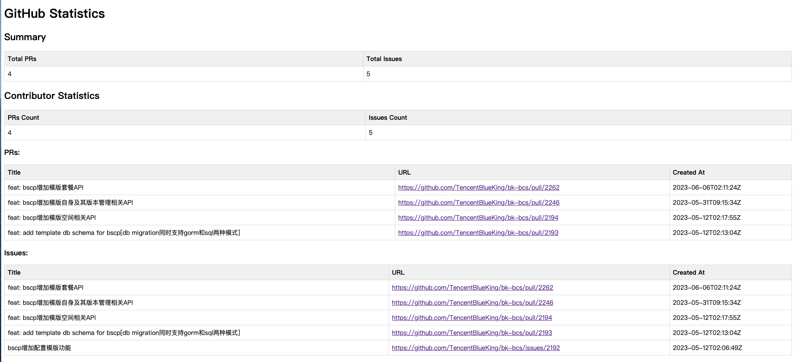

# GitHub Contributor Statistics

This program retrieves contributor statistics from a GitHub repository, including information about Pull Requests, Issues, and optionally Commits. It generates an HTML file with the statistics presented in a tabular format.

## Usage

### Prerequisites

- Go programming language (version 1.16+)
- GitHub authentication token (optional, only required for private repositories or to avoid API rate limits)

### Installation

1. Clone the repository or download the source code.
2. Open a terminal and navigate to the project directory.

### Running the Program

1. Open a terminal and navigate to the project directory.
2. Build the program using the following command:

   ```bash
   go build
   ```

3. Run the program with the desired options. Here are the available command-line flags:

    - `-repoOwner`: Repository owner (default: `TencentBlueKing`)
    - `-repoName`: Repository name (default: `bk-bcs`)
    - `-contributorUsername`: Contributor username (default: `fireyun`)
    - `-startDate`: Start date in the format `YYYY-MM-DD` (default: the start of the previous month)
    - `-endDate`: End date in the format `YYYY-MM-DD` (default: the current date)
    - `-filename`: Output filename for the generated HTML file (default: `statistics.html`)
    - `-includeCommits`: Include commit data in the statistics (default: `false`)
    - `-authToken`: GitHub authentication token (optional)
    - `-debug` : Enable debug mode to print HTTP request URLs (default: `true`)

   Example usage:

   ```bash
   ./github-contributor-stats -repoOwner=MyUsername -repoName=MyRepository -contributorUsername=MyContributor -startDate=2022-01-01 -endDate=2022-12-31 -filename=stats.html -includeCommits -authToken=MY_AUTH_TOKEN
   
    running directly without any command-line flags as ./github-contributor-stats，it is equivalent to ./github-contributor-stats -repoOwner=TencentBlueKing -repoName=bk-bcs -contributorUsername=fireyun -filename=statistics.html -includeCommits=false
   ```

4. After the program finishes running, it will generate an HTML file with the statistics. You can open the file in a web browser to view the results.

    statistics result example:

5.NOTE
>You may see error message "response returned status 403" indicates that the HTTP request to the GitHub API was forbidden. The most likely reason is that you have exceeded the rate limit for API requests without authentication.
To solve this issue, you can provide an authentication token to the program so that it can make authenticated requests and have a higher rate limit.
You can use -authToken command-line flag to solve it.